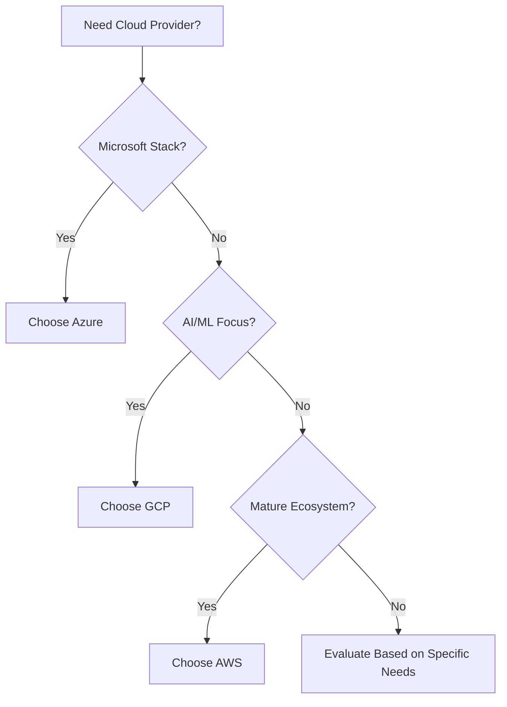

# **Cloud Computing Giants Face-Off: AWS vs. Azure vs. Google Cloud Platform**

## Introduction

The cloud computing landscape is dominated by three major players: **Amazon Web Services (AWS)**, **Microsoft Azure**, and **Google Cloud Platform (GCP)**. Each platform offers a comprehensive suite of services, but they differ significantly in their approach, pricing models, and target audiences.

Choosing the right cloud provider can make or break your project's success. With hundreds of services, complex pricing structures, and different architectural philosophies, the decision requires careful consideration of your specific needs and constraints.

In this comprehensive comparison, we'll explore the strengths and weaknesses of each platform to help you make an informed decision for your next cloud project.

---

## Market Share & Background

| Provider | Market Share (2024) | Launch Year | Primary Strength |
|----------|--------------------:|-------------|------------------|
| **AWS** | 33% | 2006 | First-mover advantage, comprehensive services |
| **Azure** | 25% | 2010 | Enterprise integration, hybrid cloud |
| **GCP** | 11% | 2008 | AI/ML services, developer experience |

- **AWS** pioneered cloud computing and maintains the largest market share with the most mature ecosystem.
- **Azure** leverages Microsoft's enterprise relationships and excels in hybrid cloud scenarios.
- **GCP** focuses on innovation, particularly in AI/ML and data analytics, with superior developer tooling.

---

## Core Services Comparison

### Compute Services

| Service Type | AWS | Azure | GCP |
|--------------|-----|-------|-----|
| **Virtual Machines** | EC2 | Virtual Machines | Compute Engine |
| **Serverless Functions** | Lambda | Azure Functions | Cloud Functions |
| **Containers** | ECS/EKS | AKS | GKE |
| **App Platform** | Elastic Beanstalk | App Service | App Engine |

```yaml
# Example: Serverless Function Deployment
# AWS Lambda
aws lambda create-function \
  --function-name my-function \
  --runtime python3.9 \
  --handler lambda_function.lambda_handler

# Azure Functions
az functionapp create \
  --name my-function \
  --resource-group myResourceGroup \
  --runtime python

# Google Cloud Functions
gcloud functions deploy my-function \
  --runtime python39 \
  --trigger-http
```

### Storage Solutions

| Storage Type | AWS | Azure | GCP |
|--------------|-----|-------|-----|
| **Object Storage** | S3 | Blob Storage | Cloud Storage |
| **Block Storage** | EBS | Disk Storage | Persistent Disk |
| **File Storage** | EFS | Files | Filestore |
| **Archive Storage** | Glacier | Archive Storage | Archive Storage |

### Database Services

| Database Type | AWS | Azure | GCP |
|---------------|-----|-------|-----|
| **Relational** | RDS | SQL Database | Cloud SQL |
| **NoSQL** | DynamoDB | Cosmos DB | Firestore |
| **Data Warehouse** | Redshift | Synapse | BigQuery |
| **In-Memory** | ElastiCache | Cache for Redis | Memorystore |

---

## Pricing Comparison

### Virtual Machine Pricing (Monthly Estimates)

| Instance Type | AWS EC2 | Azure VM | GCP Compute Engine |
|---------------|--------:|---------:|-------------------:|
| **Small (1 vCPU, 1GB RAM)** | $8.50 | $9.49 | $6.11 |
| **Medium (2 vCPU, 4GB RAM)** | $34.00 | $38.98 | $24.27 |
| **Large (4 vCPU, 16GB RAM)** | $136.00 | $155.52 | $97.09 |

> **Note**: Prices vary by region and include sustained use discounts for GCP. Always check current pricing as rates change frequently.

### Cost Optimization Features

| Feature | AWS | Azure | GCP |
|---------|-----|-------|-----|
| **Spot Instances** | ✅ Up to 90% savings | ✅ Up to 90% savings | ✅ Up to 91% savings |
| **Reserved Instances** | ✅ 1-3 year terms | ✅ 1-3 year terms | ✅ 1-3 year terms |
| **Auto-scaling** | ✅ Comprehensive | ✅ Good | ✅ Excellent |
| **Sustained Use Discounts** | ❌ | ❌ | ✅ Automatic |

---

## Performance & Reliability

### Global Infrastructure

| Metric | AWS | Azure | GCP |
|--------|-----|-------|-----|
| **Regions** | 33 | 60+ | 39 |
| **Availability Zones** | 105 | 116 | 118 |
| **Edge Locations** | 450+ | 165+ | 146+ |
| **SLA** | 99.99% | 99.95% | 99.95% |

### Performance Benchmarks

```bash
# Network Latency Test Results (Average)
# Between US East and West Coast

AWS: 67ms
Azure: 71ms  
GCP: 63ms

# Storage I/O Performance (IOPS)
# High-performance SSD

AWS EBS: 64,000 IOPS
Azure Premium SSD: 80,000 IOPS
GCP Persistent Disk: 100,000 IOPS
```

---

## AI & Machine Learning Capabilities

| Service Category | AWS | Azure | GCP |
|------------------|-----|-------|-----|
| **Machine Learning Platform** | SageMaker | Azure ML | Vertex AI |
| **Pre-trained Models** | Rekognition, Comprehend | Cognitive Services | AI Platform |
| **Speech Services** | Polly, Transcribe | Speech Services | Speech-to-Text |
| **Vision Services** | Rekognition | Computer Vision | Vision API |
| **Big Data Analytics** | EMR, Athena | Synapse, HDInsight | BigQuery, Dataflow |

**Code Example: Image Recognition**

```python
# AWS Rekognition
import boto3
rekognition = boto3.client('rekognition')
response = rekognition.detect_labels(
    Image={'S3Object': {'Bucket': 'my-bucket', 'Name': 'image.jpg'}},
    MaxLabels=10
)

# Azure Computer Vision
from azure.cognitiveservices.vision.computervision import ComputerVisionClient
vision_client = ComputerVisionClient(endpoint, credential)
analysis = vision_client.analyze_image(image_url, visual_features=['Categories'])

# Google Cloud Vision
from google.cloud import vision
client = vision.ImageAnnotatorClient()
image = vision.Image(source=vision.ImageSource(image_uri=image_url))
response = client.label_detection(image=image)
```

---

## Developer Experience & Tools

### Command Line Interfaces

| Tool | AWS | Azure | GCP |
|------|-----|-------|-----|
| **CLI Name** | AWS CLI | Azure CLI | gcloud CLI |
| **Package Manager** | pip, npm | pip, npm | pip, npm |
| **Configuration** | ~/.aws/credentials | az login | gcloud auth login |
| **Ease of Use** | Complex but powerful | User-friendly | Intuitive |

### Infrastructure as Code

```yaml
# Terraform Example: Creating a Virtual Machine

# AWS
resource "aws_instance" "web" {
  ami           = "ami-0c02fb55956c7d316"
  instance_type = "t2.micro"
  tags = {
    Name = "WebServer"
  }
}

# Azure
resource "azurerm_virtual_machine" "web" {
  name                = "web-vm"
  location            = "East US"
  resource_group_name = azurerm_resource_group.main.name
  vm_size             = "Standard_B1s"
}

# GCP
resource "google_compute_instance" "web" {
  name         = "web-vm"
  machine_type = "f1-micro"
  zone         = "us-central1-a"
  boot_disk {
    initialize_params {
      image = "debian-cloud/debian-11"
    }
  }
}
```

---

## Security & Compliance

### Security Features Comparison

| Feature | AWS | Azure | GCP |
|---------|-----|-------|-----|
| **Identity Management** | IAM | Azure AD | Cloud IAM |
| **Encryption at Rest** | ✅ KMS | ✅ Key Vault | ✅ Cloud KMS |
| **Encryption in Transit** | ✅ TLS 1.2+ | ✅ TLS 1.2+ | ✅ TLS 1.2+ |
| **Network Security** | Security Groups | Network Security Groups | Firewall Rules |
| **DDoS Protection** | Shield | DDoS Protection | Cloud Armor |

### Compliance Certifications

| Compliance | AWS | Azure | GCP |
|------------|-----|-------|-----|
| **SOC 2 Type II** | ✅ | ✅ | ✅ |
| **ISO 27001** | ✅ | ✅ | ✅ |
| **GDPR** | ✅ | ✅ | ✅ |
| **HIPAA** | ✅ | ✅ | ✅ |
| **PCI DSS** | ✅ | ✅ | ✅ |

---

## Use Case Scenarios

### When to Choose AWS

```markdown
✅ **Perfect for:**
- Startups to enterprises (widest service range)
- Complex microservices architectures
- High-performance computing workloads
- Global applications requiring extensive edge network

🎯 **Example Use Case:**
Netflix uses AWS for content delivery, data processing, 
and global streaming infrastructure.
```

### When to Choose Azure

```markdown
✅ **Perfect for:**
- Microsoft-centric organizations
- Hybrid cloud deployments
- Enterprise applications requiring Active Directory
- .NET applications and Windows workloads

🎯 **Example Use Case:**
BMW uses Azure for connected car services, 
integrating with existing Microsoft infrastructure.
```

### When to Choose GCP

```markdown
✅ **Perfect for:**
- Data analytics and AI/ML projects
- Modern container-based applications
- Startups prioritizing developer experience
- Organizations requiring advanced BigQuery analytics

🎯 **Example Use Case:**
Spotify uses GCP for data processing and machine learning
to power music recommendations.
```

---

## Migration Strategies

### Lift and Shift Approach

```bash
# AWS Migration Hub
aws migrationhub create-migration-task \
  --migration-task-name "WebApp-Migration" \
  --configuration-id "config-123"

# Azure Migrate
az migrate project create \
  --project-name "WebApp-Migration" \
  --resource-group "migration-rg"

# Google Cloud Migrate
gcloud compute images import my-image \
  --source-file gs://my-bucket/disk.vmdk \
  --os ubuntu-1804
```

### Modernization Path

| Strategy | AWS | Azure | GCP |
|----------|-----|-------|-----|
| **Containerization** | ECS, EKS | AKS | GKE |
| **Serverless** | Lambda, Fargate | Functions, Container Instances | Cloud Functions, Cloud Run |
| **Database Migration** | DMS | Database Migration Service | Database Migration Service |

---

## Cost Optimization Best Practices

### Universal Cost-Saving Tips

1. **Right-size your resources**
   ```bash
   # Monitor and adjust instance sizes based on actual usage
   # Use built-in monitoring tools from each provider
   ```

2. **Implement auto-scaling**
   ```yaml
   # Scale resources based on demand
   # Set up alerts for cost thresholds
   ```

3. **Use spot instances for non-critical workloads**
   ```bash
   # Can save 70-90% on compute costs
   # Perfect for batch processing and development
   ```

4. **Optimize storage tiers**
   ```bash
   # Move infrequently accessed data to cheaper storage
   # Implement lifecycle policies
   ```

---

## Decision Framework

### Evaluation Criteria

| Criteria | Weight | AWS Score | Azure Score | GCP Score |
|----------|--------|-----------|-------------|-----------|
| **Service Breadth** | 20% | 9/10 | 8/10 | 7/10 |
| **Pricing** | 25% | 7/10 | 7/10 | 8/10 |
| **Performance** | 20% | 8/10 | 8/10 | 9/10 |
| **Developer Experience** | 15% | 7/10 | 8/10 | 9/10 |
| **Enterprise Features** | 10% | 9/10 | 9/10 | 7/10 |
| **AI/ML Capabilities** | 10% | 8/10 | 8/10 | 9/10 |

### Quick Decision Guide



---

## Conclusion

The choice between AWS, Azure, and GCP isn't just about features—it's about finding the right fit for your organization's needs, skills, and long-term strategy.

**Choose AWS** if you need:
- The most comprehensive service portfolio
- Proven track record for large-scale applications
- Extensive third-party integrations

**Choose Azure** if you have:
- Existing Microsoft infrastructure
- Need for hybrid cloud solutions
- Strong enterprise requirements

**Choose GCP** if you prioritize:
- Superior AI/ML capabilities
- Modern developer experience
- Cost-effective data analytics

Remember: You don't have to choose just one. Many organizations successfully use multi-cloud strategies to leverage the best of each platform.

---

## Next Steps

Ready to start your cloud journey? Here's what to do next:

1. **Start with a pilot project** - Test your chosen platform with a small, non-critical application
2. **Get certified** - Invest in cloud certifications to build your team's expertise
3. **Plan your migration** - Develop a comprehensive migration strategy
4. **Monitor and optimize** - Continuously monitor costs and performance

**Need help choosing or migrating?** Our cloud experts can provide personalized guidance based on your specific requirements. **Contact us today** for a free consultation!

---

*Have experience with any of these platforms? Share your insights in the comments below and help others make informed decisions.*
